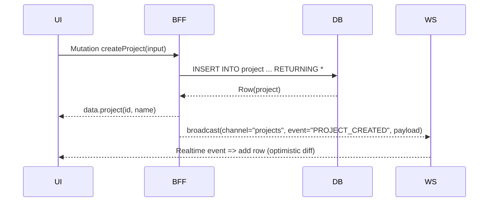
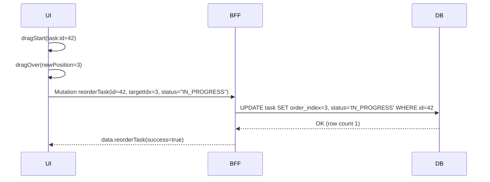
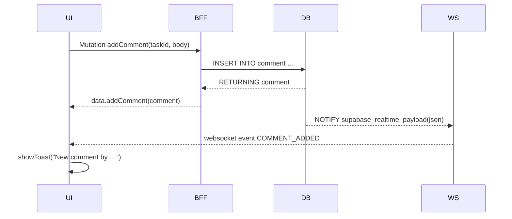
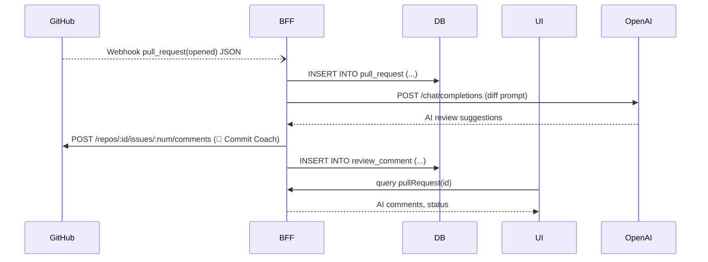

# 09\_Event\_Flow

> **バージョン:** 2025-05-30 (draft)
> **対象ブランチ:** `feature/remove-dashboard`
> **責任者:** @nakazawatarou

---

## 1. ドキュメントの目的

本書は Commit Coach における主要ユーザー操作が **UI → BFF(GraphQL) → Supabase(Postgres) → 外部サービス** の各レイヤをどのように横断するかを、シーケンス図とテキストで可視化するものです。開発者・QA・SRE がフロント／バック間の境界やイベント発火ポイントを正しく理解し、デバッグと変更影響調査を容易にすることを目的とします。

---

## 2. 記法

* **Mermaid Sequence Diagram** (`mermaid` コードフェンス) を使用
* Actor 凡例

  * `UI` … React (Next.js App Router)
  * `BFF` … Fastify + Mercurius
  * `DB` … Supabase/Postgres (SQL / RLS)
  * `WS` … Supabase Realtime (Pusher プロトコル)
  * `GH` … GitHub API/Webhook
* SNS など外部通知は `EXT` ライフラインで表記

---

## 3. フロー一覧

| ID     | シナリオ                        | 概要                         |
| ------ | --------------------------- | -------------------------- |
|  EV-01 | **Project CRUD Flow**       | プロジェクトの新規作成 / 更新 / 削除      |
|  EV-02 | **Task Drag‑and‑Drop Flow** | タスク並べ替え & ステータス変更          |
|  EV-03 | **Notification Flow**       | DB 変更 → WebSocket Toast 通知 |
|  EV-04 | **GitHub PR Sync Flow**     | PR 生成時の AI コメント往復同期        |

---

## 4. 詳細フロー

### EV‑01 Project CRUD Flow

#### ステップ説明

1. **Optimistic UI 更新** — `useMutation` で即座にキャッシュに追加
2. **RLS** — `owner_id = auth.uid()` チェック
3. **Broadcast** — `public.projects` の Postgres Trigger → Supabase Realtime → Pusher Channel `user:{owner_id}`

---

### EV‑02 Task Drag‑and‑Drop Flow

#### ポイント

* **楽観的更新** で UI 先行、失敗時 `queryClient.invalidate('tasks')`
* `order_index` 更新後、Trigger `order_reindex()` が走り一意保証

---

### EV‑03 Notification Flow (コメント追加)

#### 補足

* Realtime payload には `project_id`, `task_id`, `comment_id`, `author_id` を含む
* UI 側では現在の閲覧タスクと比較し該当ページならバッジ表示のみ、そうでない場合は Toast 表示

---

### EV‑04 GitHub PR Sync Flow

#### 詳細

* **Rate‑limit** : OpenAI 80k tokens/月
* **Idempotency** : PR webhook deliveryId 重複は `ON CONFLICT DO NOTHING`

---

## 5. イベント命名規約

| ドメイン    | Channel / 名前      | Payload 必須キー                                |
| ------- | ----------------- | ------------------------------------------- |
| project | `PROJECT_CREATED` | `id`, `name`, `owner_id`                    |
| task    | `TASK_UPDATED`    | `id`, `project_id`, `status`, `order_index` |
| comment | `COMMENT_ADDED`   | `id`, `task_id`, `author_id`                |

> **命名ルール:** `RESOURCE_VERB_PAST` (大文字スネーク) を原則。

---

## 6. ログトレーシング (OpenTelemetry)

* **TraceId 伝播**: UI → `x-trace-id` ヘッダ → BFF → DB (pg\_stat\_activity.application\_name)
* **Span 例**

  * `ui.click.create_project`
  * `bff.mutation.createProject`
  * `db.query.insert_project`
* Jaeger UI で TTL 7 days 保持

---

## 7. テスト戦略

| フロー   | テスト種別                       | ツール                                                  |
| ----- | --------------------------- | ---------------------------------------------------- |
| EV‑01 | Playwright E2E              | `expect(page.locator('tr', { hasText: 'Awesome' }))` |
| EV‑02 | React Testing Library (DND) | `fireEvent.dragAndDrop`                              |
| EV‑03 | Supabase Realtime Mock      | `ws://localhost` エミュレート                              |
| EV‑04 | Pact Contract Test          | GitHub Webhook payload v11                           |

---

## 8. 今後の拡張計画

| 期       | 追加フロー                          | 概要                     |
| ------- | ------------------------------ | ---------------------- |
| 2025 Q4 | Kanban Board Socket Sync       | Column 移動を throttle 配信 |
| 2026 Q1 | ActivityLog Stream → Data Lake | BigQuery 連携 & BI 可視化   |

---

## 9. 参考リンク

* **Mermaid Docs:** [https://mermaid.js.org/](https://mermaid.js.org/)
* **Supabase Realtime:** [https://supabase.com/docs/guides/realtime](https://supabase.com/docs/guides/realtime)
* **OpenTelemetry JS:** [https://opentelemetry.io/docs/instrumentation/js/](https://opentelemetry.io/docs/instrumentation/js/)

---

<!-- End of File -->
