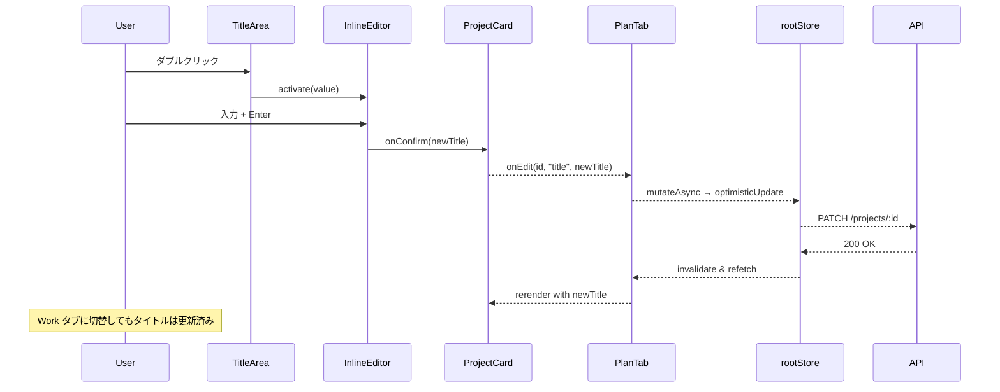

# UI コンポーネント一覧 (v2 – 2 タブ構成)

本書はダッシュボードリファクタリング (Plan / Work タブ) に伴い実装される **フロントエンド UI コンポーネント** の一覧と、そのプロパティ・イベント・責務を定義する。各コンポーネントは TypeScript + React (v18) を前提とし、状態管理は Zustand、データフェッチは React Query を利用する。

> ☝️ **命名規約**: ファイル名は `PascalCase.tsx`、props 型は `<ComponentName>Props` とする。

---

## 1. 画面レイアウト系

| コンポーネント         | 説明                                                       | 主要 Props                                       | 主要イベント                                 |
| --------------- | -------------------------------------------------------- | ---------------------------------------------- | -------------------------------------- |
| **TabSwitcher** | `Plan / Work` のタブヘッダ。選択タブのハイライトとキーボード切替 (⌘ + ←/→) をサポート。 | `activeTab: "plan" \| "work"`, `onChange(tab)` | `onChange`                             |
| **PlanTab**     | プランニング画面。`ProjectCard` をツリーで描画し、ドラッグ & ドロップを提供。          | —                                              | `onAdd`, `onEdit`, `onReorder` (下位へ伝搬) |
| **WorkTab**     | カンバン画面。`TaskColumn` をステータス別に並べる。                         | —                                              | `onEdit`, `onStatusChange`             |
| **Sidebar**     | 今後追加予定のフィルタ／統計表示。今回の範囲外。                                 | —                                              | —                                      |

---

## 2. エンティティカード系

### 2.1 ProjectCard

```
<ProjectCard
  project={project}
  onEdit={handleEdit}
  onAddTask={handleAddTask}
  onDelete={handleDelete}
  onReorder={handleReorder}
/>
```

| Prop        | 型                                                                      | 必須              | 説明            |                 |
| ----------- | ---------------------------------------------------------------------- | --------------- | ------------- | --------------- |
| `project`   | `Project`                                                              | ✔︎              | 表示対象プロジェクトモデル |                 |
| `onEdit`    | \`(id: ID, field: "title" \| "description" \| "dueDate", value: string | Date) => void\` | ✔︎            | **編集フロー用 (新規)** |
| `onAddTask` | `(projectId: ID) => void`                                              | ✔︎              | 新規タスク作成トリガ    |                 |
| `onDelete`  | `(id: ID) => void`                                                     | ✔︎              | 削除要求          |                 |
| `onReorder` | \`(sourceId: ID, targetId: ID                                          | null) => void\` | ✔︎            | ドラッグ並び替え        |

#### 内部構造

* **DragHandle** (左端 24 px)
* **TitleArea** (ダブルクリックで `InlineEditor`)
* **HoverToolbar** (✏️ / 🗑️ / ＋)
* **TaskList** (子 `TaskCard` をレンダリング)

### 2.2 TaskCard

`ProjectCard` とほぼ同一インターフェースだが、`onAddSubtask` を持つ。

### 2.3 SubtaskListItem

チェックボックス + タイトル + DragHandle のシンプル行アイテム。

---

## 3. 編集ユーティリティ系

| コンポーネント               | 説明                                             | 主要 Props                                         |
| --------------------- | ---------------------------------------------- | ------------------------------------------------ |
| **InlineEditor**      | テキストフィールドをインライン編集 UI に切替える HOC。                | `value`, `onConfirm`, `onCancel`, `placeholder`  |
| **DatePickerPopover** | 期日編集用。Radix UI Popover + React Day Picker を利用。 | `date`, `onSelect(date)`, `minDate?`, `maxDate?` |
| **HoverToolbar**      | カードホバー時に表示されるアクションボタン群。                        | `onEdit`, `onDelete`, `onAddChild?`              |
| **DragHandle**        | pointerイベントを `dnd-kit` に委譲。カード内部の共通握り。         | `size` (既定 24)                                   |

---

## 4. カンバン専用コンポーネント

| コンポーネント           | 説明                                                       | Props                                                            |
| ----------------- | -------------------------------------------------------- | ---------------------------------------------------------------- |
| **TaskColumn**    | ステータス別の列（*Todo*, *Doing*, *Done*）。Drag & Drop でステータス変更可。 | `status: "todo" \| "doing" \| "done"`, `tasks`, `onDrop(taskId)` |
| **TaskCardSmall** | Work タブ内の縮小カードバリエーション。                                   | 同 TaskCard だがレイアウト最適化                                            |

---

## 5. 汎用コンポーネント

| コンポーネント                | 説明                                 |
| ---------------------- | ---------------------------------- |
| **AddEntityButton**    | “＋” アイコンとホバーラベルを持つ丸ボタン。ARIA ラベル必須。 |
| **ConfirmationDialog** | Radix UI Dialog ベース。削除時に使用。        |
| **Toast**              | サーバ通信結果を表示。成功 = 緑、失敗 = 赤。          |

---

## 6. イベントフロー図 (概要)



---

## 7. スタイルガイド要点

* **タイポグラフィ**: Inter / Noto Sans JP, 14 px–20 px レンジ。
* **カラー**: プロダクト基調色 #4F6AFB、アクセント #FF6B6B。
* **シャドウ**: `0 4px 12px rgba(0,0,0,0.08)` – フラット過ぎない程度に。
* **角丸**: カードは `border-radius: 12px`。
* **アクセシビリティ**: ホバーのみを頼らず、フォーカスリングを明示し、ARIA ラベル追加。

---

## 8. 今後の拡張予定

* **AttachmentPreview**: ファイル添付プレビュー (v2.1)
* **CommentSection**: スレッド型コメント (v3)
* **ProgressBar**: プロジェクト進捗を円グラフで表示 (v2.2)

---

© 2025 Commit Coach フロントエンドチーム
