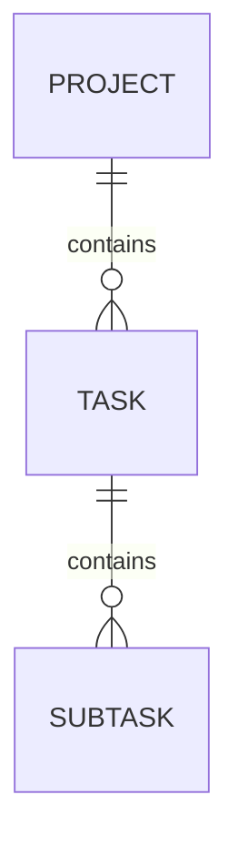

# バックエンド移行ガイド (v2 – RDB → DocStore & 2‑Tab API)

本書は旧バージョンの **PostgreSQL + REST v1** バックエンドを、**Document‑Store（CockroachDB JSONB）+ REST/WebSocket v2** へゼロダウンタイムで移行する手順をまとめる。移行は **blue‑green デプロイ** と **デュアルライト (dual‑write)** 戦略を採用し、ロールバック可能な構成を保証する。

> **対象リポジトリ**: `github.com/ttaarroo77/commit_coach_backend`
>
> **移行ブランチ**: `main` → `feat/docstore-migration`

---

## 1. 移行方針サマリ

1. **スキーマ互換レイヤ**を用意し、v2 API でも旧テーブルへ書き込む (dual‑write)。
2. CockroachDB に **JSONB モデル** を作成し、データを *chunk copy* (並列でCOPY)。
3. 全リクエストを **read‑after‑write** で DocStore を優先し、RDB はフェイルオーバ。
4. 完全切替後に RDB の書き込みを停止 → 60 日保持 → 削除。

---

## 2. 新旧データモデル比較

| Entity  | RDB (PostgreSQL)                                                             | DocStore (CockroachDB)                                                           |
| ------- | ---------------------------------------------------------------------------- | -------------------------------------------------------------------------------- |
| Project | `projects(id UUID PK, title TEXT, description TEXT, due_date DATE, idx INT)` | `projects/{projectId}` ドキュメント<br>`{ title, description, dueDate, tasks: [...] }` |
| Task    | `tasks(id UUID PK, project_id FK, title, status, idx)`                       | ネスト or 別コレクション `tasks/{taskId}` (参照型)                                            |
| Subtask | `subtasks(id UUID PK, task_id FK, title, done)`                              | `subtasks/{subId}`                                                               |

**設計ポイント**

* **ネスト上限**を 2 階層 (Project → Task) までに抑え、Subtask は個別ドキュメント (高速フィルタ用)。
* `version` フィールドを追加し、クライアントの `If‑Match` と同期。

---

## 3. マイグレーション工程

### 3.1 Blue インフラ準備

1. k8s namespace `backend‑v2` を作成。
2. CockroachDB cluster (3 node) を `db‑v2` にデプロイ。
3. Secret Store に新接続文字列 `COCKROACH_URL` を登録。

### 3.2 データコピー

1. **Export**: `pg_dump --format=custom --table=projects --table=tasks ...`
2. **Transform**: `scripts/transform_to_jsonl.ts` で JSONL へ整形。<br>   *Tasks を Project.groupId ごとに embed*
3. **Import**: `cockroach sql --execute="IMPORT INTO projects JSON DATA 's3://...' WITH detach"`
4. **Verify**: row count & CRC32 一致をシェルスクリプトで比較。

### 3.3 Dual‑Write 実装

```go
func SaveProject(ctx, p) {
  tx1 := pg.Begin()
  tx2 := crdb.Begin()
  defer rollbackOnErr(tx1, tx2)

  tx1.Exec("INSERT INTO projects ...")
  tx2.Exec("UPSERT INTO projects ...")

  tx1.Commit(); tx2.Commit();
}
```

* エラー時は **2 相コミット** ロールバック。
* メトリクス `dual_write_lag_seconds` を Prometheus で監視。

### 3.4 Read Path 切替

1. v2 API サービスで `Prefer: docstore` ヘッダを受信した場合 DocStore 読み。
2. Canary 5% ユーザ token に Prefer ヘッダを付与し、エラー率を計測 (<0.1%)。
3. 問題なければ 100% へ拡大し、RDB 読みをフェイルオーバ専用にする。

### 3.5 最終切替 & RDB フリーズ

1. ConfigMap `DUAL_WRITE_ENABLED=false` で PostgreSQL への write を停止。
2. バックグラウンドジョブで DocStore→RDB の差分を 0 件になるまで同期。
3. CloudWatch Alarm で差分 0 を確認後、PostgreSQL read-only に設定。
4. 60 日後に namespace `db-v1` を削除。

---

## 4. リリースチェックリスト

| 項目                | 目標値      | 達成条件                                       |
| ----------------- | -------- | ------------------------------------------ |
| API レイテンシ p95     | ≤ 120 ms | Curl ベンチ & Datadog APM                     |
| Dual write 失敗率    | < 0.01%  | `dual_write_fail_total / dual_write_total` |
| CRC32 差分          | 0        | nightly job log = 0                        |
| Cockroach CPU 使用率 | < 60%    | k8s hpa target                             |

---

## 5. ロールバック手順

1. ConfigMap `DOCSTORE_READ_ENABLED=false` で即時 RDB へ戻す。
2. Canary unset → 全ユーザ RDB 読み。
3. Sentry `docstore.*` エラーが消えたことを確認。

平均復旧時間 (MTTR) 目標: **< 10 分**。

---

## 6. バッチ/スクリプト

| スクリプト                           | 目的                  | 実行方法                                                            |
| ------------------------------- | ------------------- | --------------------------------------------------------------- |
| `scripts/transform_to_jsonl.ts` | RDB dump → JSONL 変換 | `pnpm ts-node scripts/transform_to_jsonl.ts dump.sql out.jsonl` |
| `scripts/compare_crc.py`        | row hash 照合         | `python compare_crc.py --rdb-url ... --crdb-url ...`            |
| `scripts/fill_version.go`       | version フィールドを補完    | Go 1.22                                                         |

---

## 7. Post‑Migration Cleanup

* `docker-compose.yml` から PostgreSQL サービスを削除。
* Secrets `POSTGRES_URL` を Vault から revoke。
* Grafana dashboard ID 100 (RDB) をアーカイブ、Cockroach dashboard をデフォルトに。

---

## 8. 付録: ER 図 (DocStore)



---

© 2025 Commit Coach バックエンドチーム
