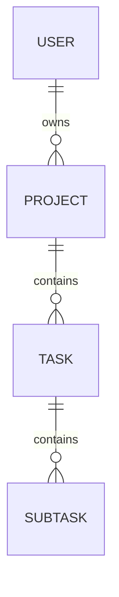

# データモデル定義書 (v2 – Commit Coach)

本書は 2 タブダッシュボード (v2) で利用する **データ構造の完全仕様** を示す。RDB (PostgreSQL v1) と DocStore (CockroachDB JSONB v2) の両レイヤをカバーし、属性型・制約・インデックス・JSON スキーマを包括的に記載する。

---

## 1. コンセプト ER 図



---

## 2. エンティティ定義 (論理モデル)

### 2.1 User

| 属性        | 型         | 必須 | 説明                 |
| --------- | --------- | -- | ------------------ |
| id        | UUID      | ✔︎ | 主キー／SSO サブ ID にマップ |
| name      | TEXT      | ✔︎ | 表示名                |
| email     | TEXT      | ✔︎ | 一意・インデックス          |
| createdAt | TIMESTAMP | ✔︎ | ISO-8601 UTC       |
| updatedAt | TIMESTAMP | ✔︎ | —                  |

### 2.2 Project

| 属性          | 型         | 必須 | デフォルト | 説明           |
| ----------- | --------- | -- | ----- | ------------ |
| id          | UUID      | ✔︎ | —     | 主キー          |
| ownerId     | UUID      | ✔︎ | —     | FK → User.id |
| title       | TEXT      | ✔︎ | —     | 100 文字上限     |
| description | TEXT      | —  | ""    | Markdown OK  |
| dueDate     | DATE      | —  | null  | 期日           |
| idx         | INT       | ✔︎ | 0     | 並び順 (ASC)    |
| version     | INT       | ✔︎ | 1     | ETag 生成元     |
| createdAt   | TIMESTAMP | ✔︎ | NOW   | —            |
| updatedAt   | TIMESTAMP | ✔︎ | NOW   | —            |

**インデックス**

```sql
CREATE INDEX idx_projects_owner_sort ON projects(owner_id, idx);
```

### 2.3 Task

| 属性           | 型         | 必須 | 説明                      |             |
| ------------ | --------- | -- | ----------------------- | ----------- |
| id           | UUID      | ✔︎ | 主キー                     |             |
| projectId    | UUID      | ✔︎ | FK → Project.id         |             |
| title        | TEXT      | ✔︎ | —                       |             |
| status       | ENUM      | ✔︎ | 'todo'\|'doing'\|'done' |             |
| description  | TEXT      | —  | —                       |             |
| dueDate      | DATE      | —  | —                       |             |
| idx          | INT       | ✔︎ | プロジェクト内並び順              |             |
| spentMinutes | INT       | ✔︎ | 0                       | タイムトラッキング合計 |
| version      | INT       | ✔︎ | 1                       | —           |
| createdAt    | TIMESTAMP | ✔︎ | —                       |             |
| updatedAt    | TIMESTAMP | ✔︎ | —                       |             |

### 2.4 Subtask

| 属性        | 型         | 必須 | 説明           |
| --------- | --------- | -- | ------------ |
| id        | UUID      | ✔︎ | 主キー          |
| taskId    | UUID      | ✔︎ | FK → Task.id |
| title     | TEXT      | ✔︎ | —            |
| done      | BOOLEAN   | ✔︎ | false        |
| idx       | INT       | ✔︎ | 並び順          |
| version   | INT       | ✔︎ | 1            |
| createdAt | TIMESTAMP | ✔︎ | —            |
| updatedAt | TIMESTAMP | ✔︎ | —            |

---

## 3. DocStore JSON スキーマ

### 3.1 Project (Embedded Tasks)

```jsonc
{
  "$schema": "https://json-schema.org/draft/2020-12/schema",
  "title": "Project",
  "type": "object",
  "required": ["id", "ownerId", "title", "version", "tasks"],
  "properties": {
    "id": { "type": "string", "format": "uuid" },
    "ownerId": { "type": "string", "format": "uuid" },
    "title": { "type": "string", "maxLength": 100 },
    "description": { "type": "string" },
    "dueDate": { "type": ["string", "null"], "format": "date" },
    "version": { "type": "integer", "minimum": 1 },
    "createdAt": { "type": "string", "format": "date-time" },
    "updatedAt": { "type": "string", "format": "date-time" },
    "tasks": {
      "type": "array",
      "items": { "$ref": "#/definitions/Task" }
    }
  },
  "definitions": {
    "Task": {
      "type": "object",
      "required": ["id", "title", "status", "subtasks"],
      "properties": {
        "id": { "type": "string", "format": "uuid" },
        "title": { "type": "string" },
        "status": { "enum": ["todo", "doing", "done"] },
        "description": { "type": "string" },
        "dueDate": { "type": ["string", "null"], "format": "date" },
        "spentMinutes": { "type": "integer", "minimum": 0 },
        "version": { "type": "integer", "minimum": 1 },
        "subtasks": {
          "type": "array",
          "items": {
            "type": "object",
            "required": ["id", "title", "done"],
            "properties": {
              "id": { "type": "string", "format": "uuid" },
              "title": { "type": "string" },
              "done": { "type": "boolean" },
              "version": { "type": "integer", "minimum": 1 }
            }
          }
        }
      }
    }
  }
}
```

---

## 4. バージョン管理 & 競合解決

* 各ドキュメントに **`version`** フィールドを持たせ、PATCH 時に `If-Match: "v<version>"` を必須化。
* 競合時は 409 を返し、クライアントはマージ or 上書きを UI で選択。

---

## 5. インデックス設計 (CockroachDB)

```sql
-- Project 所有者別の一覧クエリ
CREATE INDEX ON projects ((jsonb_extract_path_text(data, 'ownerId')));

-- Task ステータスフィルタ
CREATE INDEX ON tasks ((jsonb_extract_path_text(data, 'status')));

-- Subtask done=false のみ抽出
CREATE INDEX ON subtasks ((data ->> 'done')) WHERE data ->> 'done' = 'false';
```

---

## 6. 参照／整合性ポリシー

* DocStore では外部キー制約が無い代わりに **アプリケーション層で整合性を保証**。削除 cascade はバックエンドサービスで実施。
* User → Project 削除時は `project.deletedAt` を NULL→timestamp に更新し、30 日のソフト削除期間を設ける。

---

## 7. サンプルドキュメント

```jsonc
{
  "id": "prj_abc",
  "ownerId": "usr_123",
  "title": "Marketing Site Redesign",
  "description": "新 LP 作成プロジェクト",
  "dueDate": "2025-09-30",
  "version": 12,
  "createdAt": "2025-05-20T10:00:00Z",
  "updatedAt": "2025-05-25T02:15:00Z",
  "tasks": [
    {
      "id": "tsk_xyz",
      "title": "Figma デザイン案",
      "status": "doing",
      "dueDate": "2025-06-15",
      "spentMinutes": 240,
      "version": 7,
      "subtasks": [
        { "id": "sub1", "title": "Hero セクション", "done": true, "version": 2 },
        { "id": "sub2", "title": "プライシング表", "done": false, "version": 1 }
      ]
    }
  ]
}
```

---

## 8. 今後の拡張案

| 予定             | 内容                                                  |
| -------------- | --------------------------------------------------- |
| **Tagging**    | Task/Subtask にタグ配列を追加し、ボードでフィルタリング                  |
| **Attachment** | File メタ情報を `attachments` 配列で保持、S3 presigned URL を格納 |
| **Comment**    | `comments` サブコレクションを別テーブルに分離、WebSocket push         |

---

© 2025 Commit Coach データアーキテクトチーム
