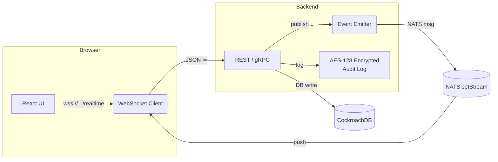
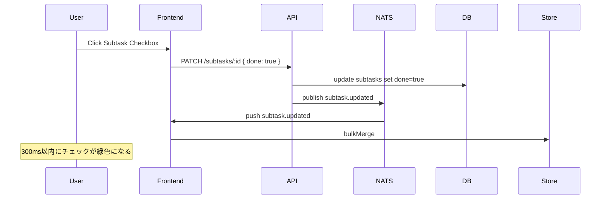

# イベントフロー仕様書 (v2 – Commit Coach リアルタイム同期 & 監査ログ)

本書は 2 タブ版ダッシュボードにおける **リアルタイム双方向通信 (WebSocket)** と **監査ログ (Audit Log)** のイベント種別・シーケンス・ペイロード仕様を定義する。クライアント ↔ バックエンド ↔ メッセージブローカー間で、データ一貫性とスケーラビリティを確保することが目的。

---

## 1. 全体構成図



---

## 2. イベントチャンネル一覧

| Channel     | 発行元 | 購読対象            | 説明                 |
| ----------- | --- | --------------- | ------------------ |
| `project.*` | API | Browser, Worker | プロジェクト CRUD        |
| `task.*`    | API | Browser, Worker | タスク CRUD / ステータス変更 |
| `subtask.*` | API | Browser, Worker | サブタスク CRUD         |
| `order.*`   | API | Browser         | 並び順更新              |
| `audit.*`   | API | Audit Worker    | 監査ログ専用 (非公開)       |

> **命名規約**: `<entity>.<action>`（例: `task.updated`, `order.tasks.reordered`）

---

## 3. ペイロード共通フォーマット

```jsonc
{
  "event": "task.updated",
  "version": 1,
  "timestamp": "2025-05-25T05:00:00Z",
  "actor": {
    "id": "usr_123",
    "name": "T. Nakazawa"
  },
  "payload": { /* action-specific */ }
}
```

* **version**: イベントスキーマのメジャー番号。変更時は後方互換がある限り increment minor。
* **actor**: 発生ユーザ。システムタスクの場合は `system`。

---

## 4. 代表イベント仕様

### 4.1 `task.created`

| フィールド       | 型          | 必須 | 説明                  |
| ----------- | ---------- | -- | ------------------- |
| `projectId` | UUID       | ✔︎ | 親プロジェクト             |
| `task`      | Taskオブジェクト | ✔︎ | 08\_data\_model に準拠 |

### 4.2 `task.updated`

| フィールド    | 型          | 必須 | 説明    |
| -------- | ---------- | -- | ----- |
| `taskId` | UUID       | ✔︎ |       |
| `diff`   | JSON Patch | ✔︎ | 変更点のみ |

### 4.3 `order.tasks.reordered`

```jsonc
{
  "projectId": "prj_1",
  "taskIds": ["tsk_b", "tsk_a", "tsk_c"]
}
```

---

## 5. 受信クライアント実装ガイド

```ts
const socket = new WebSocket("wss://api.commitcoach.app/realtime?token=<jwt>");

socket.onmessage = (ev) => {
  const msg = JSON.parse(ev.data);
  switch (msg.event) {
    case "task.updated":
      useRootStore.getState().bulkMergeTask(msg.payload);
      break;
    case "order.tasks.reordered":
      useRootStore.getState().reorderTasks(msg.payload);
  }
};
```

* **再接続**: `backoff: [1s, 2s, 5s, 10s]`、5 回失敗でトースト表示。
* **ACK**: ブラウザはメッセージ処理後に `{ ack: msgId }` を返し、Broker 側で確認。

---

## 6. 監査ログ (Audit Log)

| フィールド       | 型         | 説明                |
| ----------- | --------- | ----------------- |
| `id`        | ULID      | ソート可能キー           |
| `actorId`   | UUID      | 操作者               |
| `ip`        | INET      | 元 IP アドレス         |
| `event`     | TEXT      | `task.deleted` など |
| `payload`   | JSONB     | 原文保管 (暗号化)        |
| `createdAt` | TIMESTAMP | —                 |

* **保存期間**: 365 日 → S3 Glacier へ自動アーカイブ。
* **閲覧権限**: `admin` ロールのみ。

---

## 7. QoS / 冪等性ポリシー

| 項目   | 設定                                                     |
| ---- | ------------------------------------------------------ |
| 伝送保証 | At‑least‑once (ACK / retry)                            |
| 重複検出 | `msgId` を 30 秒 LRU キャッシュでフィルタ                          |
| 並び順  | 同一 `projectId` 内は順序維持 (NATS JetStream Stream ordering) |

---

## 8. シーケンス図サンプル

### 8.1 タスク完了チェック



---

## 9. バージョンアップ手順

1. 新イベント追加 → `version` を上げずに OK (後方互換)。
2. 既存イベントの breaking change → `version`++ & 並行配信 (`task.updated.v1`, `.v2`).
3. 旧バージョン廃止時は Deprecation Notice を 60 日前に送付。

---

© 2025 Commit Coach プロダクト基盤チーム
